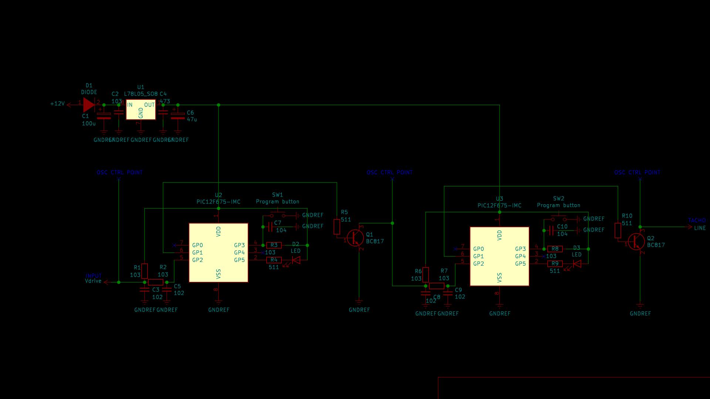

# Universal signal divider/multiplier

Sometimes after an engine/dashboard swap one needs the signals come from engine or supplemental parts to be adopted accordingly. This schematics allow to pick up multiply/divide coefficients according to any needs.

For example, we swapped 6-cylinders engine to 8-cylinders while having the dashboard from 6-cyl. Thus, the adoption coefficient should be 6/8=0.75 (having 8 strokes from engine/ECU, but the dashboard obtains 6 as a maximum). To achieve that, we need to multiply the income signal to 3 and divide to 4 (3/4=0.75). The first MCU would be responsible for multiplying, the second is for dividing. Each one is programmable separately using the SW1/SW2 button.

## Firmware

Pre-flash the firmware [__pic12f675_mul_div_uni.hex__](pic12f675_mul_div_uni.hex) on each MCU (U2 and U3) using any available PIC flasher.

## Programming MCUs

1. Power on the board while pressing SW1 or SW2 button (SW1 to program MCU1(U2), SW2 to program MCU2(U3)). The led (D2 or D3) flashes fast 20 times - that means you are in programming mode. You'll have 3 registers to program on each one while having the same firmware [__pic12f675_mul_div_uni.hex__](pic12f675_mul_div_uni.hex) on them. Each led flash means the current status of the register. By default the MCU is settled to divide operation by 2. By short pressing the button (SW1/SW2 depends on what PIC you're currently programming) you may change the register value. By long pressing the button you store the value in the current register and move to the next one. After programming just power off the board, power on again to make it operatible or power on with pressing SW1/SW2 buttons to re-program MCUs.

- First register is responsible for the operation (1 flash - divide (default value), 2 flashes - multiplication)

- Second register - decimal part of division/multiplication coefficient (0 by default)

- Third register - sub-decimal unit of division/multiplication (2 by default)

Thus, by default all registers are like 1-0-2. In a case described above we should perform re-programming the first MCU to be 2-0-3 and the second to be 1-0-4 to achieve 0.75 signal normalization from ECU to dashboard.

## Schematics

[Kicad project](pic12f675_mul_div_universal)

